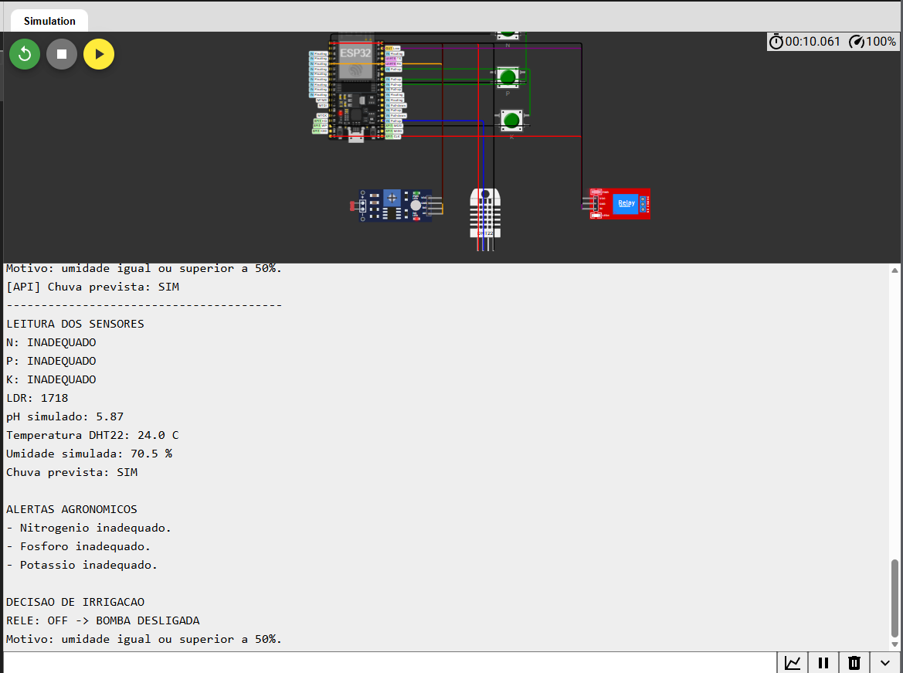
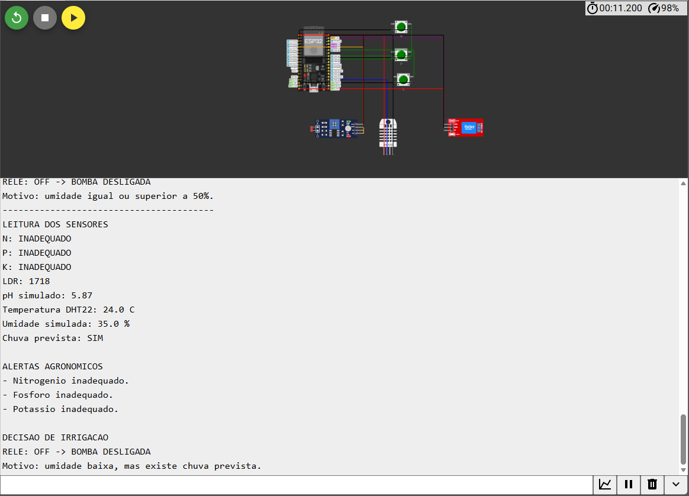

# FarmTech Solutions — Fase 2

Projeto acadêmico da FIAP para simulação de um sistema de irrigação inteligente com ESP32 no Wokwi, utilizando sensores didáticos e integração com uma API meteorológica pública.

## Integrantes

- Caio Barros Queiroz — `rm576443@fiap.com.br`
- Paulo Vitor Isidoro Silva — `rm575580@fiap.com.br`
- Kauê Cavalcanti Araujo — `rm576394@fiap.com.br`
- Juliana — `rm579614@fiap.com.br`

## 1. Objetivo

O projeto simula uma fazenda inteligente capaz de monitorar condições agronômicas e decidir quando acionar uma bomba de irrigação.

O ESP32 recebe:

- Nitrogênio (N) por botão;
- Fósforo (P) por botão;
- Potássio (K) por botão;
- pH simulado por LDR;
- umidade simulada por DHT22;
- chuva prevista obtida pelo programa Python através da API pública Open-Meteo.

A saída é um relé que representa a bomba d'água.

## 2. Cultura escolhida

A cultura escolhida é o **café arábica (Coffea arabica)**, mantendo a continuidade da pesquisa já iniciada no projeto.

A Embrapa Ater+ Digital explica que, no manejo hídrico do café, a irrigação deve ser iniciada antes de o solo atingir o ponto de murcha e apresenta como referência uma umidade próxima de 50% da Água Facilmente Disponível (AFD) para evitar estresse hídrico. A mesma fonte ressalta que não existe uma porcentagem única de umidade aplicável a todos os solos. Portanto, o limite de 50% usado neste projeto é uma **aproximação didática**, e não uma leitura real de água disponível no solo. ([Embrapa](https://www.atermaisdigital.cnptia.embrapa.br/web/cafe/fase-de-producao-ou-manutencao))

## 3. Substituições didáticas

| Elemento agrícola | Componente Wokwi | Interpretação |
|---|---|---|
| Nitrogênio | Botão verde | pressionado = condição adequada |
| Fósforo | Botão verde | pressionado = condição adequada |
| Potássio | Botão verde | pressionado = condição adequada |
| pH do solo | LDR | leitura analógica convertida para 0–14 |
| Umidade do solo | DHT22 | umidade do ar interpretada como umidade do solo |
| Bomba | Relé | ON = irrigação ligada |

Essas substituições são exclusivamente para a simulação solicitada pela atividade. Um LDR não mede pH e um DHT22 não mede umidade do solo.

## 4. Ligações

| Componente | GPIO |
|---|---:|
| Botão N | 18 |
| Botão P | 19 |
| Botão K | 21 |
| LDR AO | 34 |
| DHT22 SDA | 15 |
| Relé IN | 23 |

Os botões usam `INPUT_PULLUP`: pressionado corresponde a `LOW` no GPIO e é convertido pelo programa para “adequado”.

O relé foi validado no Wokwi com acionamento em nível alto (`HIGH`), apresentando mudança visual coerente entre os estados ligado e desligado.

## 5. Conversão do LDR para pH

O LDR mede intensidade luminosa. Para atender à proposta didática da atividade, o valor ADC do ESP32 (0 a 4095) é convertido linearmente para uma escala simulada de 0 a 14:

```text
pH_simulado = leitura_LDR / 4095 × 14
```

Para a simulação, a faixa escolhida é:

```text
5,5 <= pH <= 6,0
```

Ao alterar N, P ou K durante a demonstração, o grupo também deve alterar o LDR para representar uma mudança de pH, conforme solicitado no enunciado.

## 6. Regra de irrigação

A umidade é o fator principal da decisão hídrica.

### Irrigação ON

```text
umidade < 50%
E
chuva prevista = NÃO
```

### Irrigação OFF

A bomba permanece desligada quando:

- umidade >= 50%; ou
- chuva prevista = SIM.

### NPK e pH

N, P, K e pH não acionam a bomba diretamente. Quando estão fora da condição simulada, o sistema gera alertas no Monitor Serial.

Essa separação foi escolhida porque deficiência nutricional e pH inadequado são questões de manejo agronômico diferentes da necessidade imediata de água.

## 7. Ir Além 1 — API meteorológica

Foi utilizada a **Open-Meteo Weather Forecast API**. A API fornece previsão horária, incluindo probabilidade de precipitação e precipitação. ([Open-Meteo](https://open-meteo.com/en/docs))

O programa `python/clima_api.py` analisa as próximas 6 horas.

O grupo definiu os seguintes critérios didáticos:

- probabilidade máxima de precipitação >= 40%; **ou**
- precipitação acumulada prevista >= 1,0 mm.

Quando uma dessas condições é satisfeita, Python imprime:

```text
CHUVA=SIM
```

Caso contrário:

```text
CHUVA=NAO
```

O comando é inserido no Monitor Serial do Wokwi. O ESP32 então atualiza a variável `chuvaPrevista` e usa essa informação na decisão da bomba.

### Fluxo da integração

```text
API Open-Meteo
       ↓
python/clima_api.py
       ↓
CHUVA=SIM / CHUVA=NAO
       ↓
Monitor Serial Wokwi
       ↓
ESP32
       ↓
Regra de irrigação
       ↓
Relé
```

## Estado atual da validação

O circuito foi compilado e testado no Wokwi. Foram confirmados:

- leitura dos botões N, P e K;
- variação do LDR e conversão para pH simulado;
- ajuste da umidade pelo DHT22;
- relé ligado com umidade abaixo de 50% e sem chuva;
- relé desligado com umidade suficiente;
- bloqueio da irrigação com `CHUVA=SIM`;
- retorno da irrigação com `CHUVA=NAO`;
- comando `STATUS`;
- mudança visual do módulo de relé;
- demonstração de alteração de NPK acompanhada de alteração do LDR/pH;
- consulta meteorológica em Python com a Open-Meteo.

O opcional em R não foi implementado e não é necessário para a entrega obrigatória.

## 8. Testes recomendados

| Cenário | Umidade | Chuva | Resultado |
|---|---:|---|---|
| Solo úmido | 70% | não | Relé OFF |
| Solo seco | 35% | não | Relé ON |
| Solo seco + chuva | 35% | sim | Relé OFF |
| Solo úmido + NPK inadequado | 75% | não | Relé OFF + alertas |
| Solo seco + pH inadequado | 35% | não | Relé ON + alerta de pH |

## 9. Como executar

### Wokwi

1. Abra um projeto ESP32 no Wokwi.
2. Copie `esp32/diagram.json` para o projeto.
3. Copie `esp32/sketch.ino` para o editor.
4. Adicione as bibliotecas indicadas em `esp32/libraries.txt`.
5. Inicie a simulação.
6. Abra o Monitor Serial em 115200 baud.
7. Clique nos botões N, P e K para alterar seus estados.
8. Clique no DHT22 para alterar temperatura/umidade durante a simulação.
9. Altere o valor de luz do LDR para modificar o pH simulado.
10. Observe o relé e as mensagens do Monitor Serial.

### Python

Na raiz do repositório, execute:

```bash
python python/clima_api.py --latitude LATITUDE --longitude LONGITUDE
```

Substitua `LATITUDE` e `LONGITUDE` pelas coordenadas da área que será representada como fazenda.

Copie o comando final (`CHUVA=SIM` ou `CHUVA=NAO`) para o Monitor Serial do Wokwi.

## 10. Estrutura do projeto

```text
FarmTech-Solutions-Fase2/
├── esp32/
│   ├── diagram.json
│   ├── libraries.txt
│   ├── sketch.ino
│   └── README.md
├── python/
│   ├── clima_api.py
│   ├── test_clima_api.py
│   ├── requirements.txt
│   └── README.md
├── dados/
├── docs/
│   ├── conexoes_wokwi.md
│   ├── divisao_tarefas.md
│   ├── logica_irrigacao.md
│   ├── pesquisa_cafe.md
│   ├── revisao_tecnica.md
│   └── roteiro_testes.md
├── imagens/
├── r/
├── CONTRIBUTING.md
└── README.md
```

## 11. Entregáveis da FIAP

- [x] Circuito definido em `esp32/diagram.json`;
- [x] Código C/C++ organizado em `esp32/sketch.ino`;
- [x] Integração com API pública em `python/clima_api.py`;
- [x] Documentação da lógica;
- [x] Compilar e validar o circuito completo no Wokwi;
- [x] Registrar os resultados em `docs/roteiro_testes.md`;
- [ ] Captura real do circuito no Wokwi em `imagens/circuito-wokwi.png`;
- [ ] Captura da irrigação ligada;
- [ ] Captura da irrigação desligada;
- [ ] Link do vídeo de até 5 minutos no YouTube;
- [ ] Revisão final e conferência dos commits individuais do grupo.

## Evidências visuais

As capturas finais foram definidas com os seguintes nomes. Assim que os arquivos forem enviados para a pasta `imagens/`, elas aparecerão automaticamente abaixo.

### Circuito completo no Wokwi


### Irrigação ligada

Cenário de referência: umidade em aproximadamente 35%, sem chuva prevista e relé ligado.



### Irrigação desligada por previsão de chuva

Cenário de referência: umidade em aproximadamente 35%, `CHUVA=SIM` e relé desligado.



## 12. Referências

- Embrapa Ater+ Digital — Manejo Hídrico do Café: https://www.atermaisdigital.cnptia.embrapa.br/web/cafe/fase-de-producao-ou-manutencao
- Open-Meteo — Weather Forecast API: https://open-meteo.com/en/docs
- Wokwi — Pushbutton: https://docs.wokwi.com/parts/wokwi-pushbutton
- Wokwi — DHT22: https://docs.wokwi.com/parts/wokwi-dht22
- Wokwi — Photoresistor: https://docs.wokwi.com/parts/wokwi-photoresistor-sensor
- Wokwi — Relay Module: https://docs.wokwi.com/parts/wokwi-relay-module
- Wokwi — Diagram Format: https://docs.wokwi.com/diagram-format

## 13. Vídeo

Adicionar aqui o link do vídeo não listado após a gravação:

```text
https://www.youtube.com/watch?v=SEU_VIDEO
```


## 14. Estado atual da entrega

A validacao funcional do circuito foi concluida no Wokwi. Foram validados N, P, K, LDR/pH, DHT22, rele ON/OFF, CHUVA=SIM, CHUVA=NAO, STATUS e a integracao Python/Open-Meteo. O opcional em R nao foi implementado. Permanecem pendentes as imagens finais no repositorio, o video de ate 5 minutos, o link do video e a revisao final antes da entrega.
